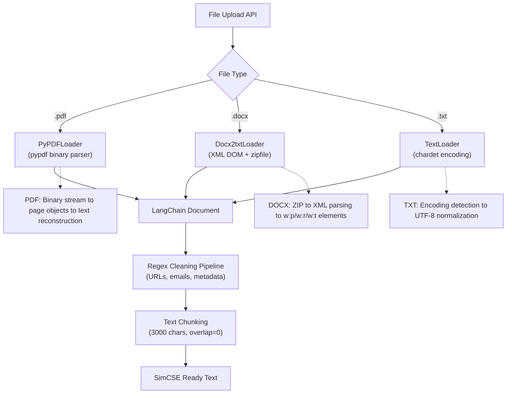

**Key Technical Implementation:**

**Format-Specific Parsing:**
- **PDF**: pypdf library for binary stream parsing and page object extraction
- **DOCX**: zipfile + xml.etree.ElementTree for XML DOM navigation (w:p to w:r to w:t hierarchy)  
- **TXT**: chardet for encoding detection with UTF-8 normalization

**Common Processing Pipeline:**
- LangChain Document object standardization
- Regex cleaning: URLs (http patterns), emails (word@domain patterns), DOI patterns
- RecursiveCharacterTextSplitter: 3000 character chunks, no overlap
- Output optimization for SimCSE token processing
```