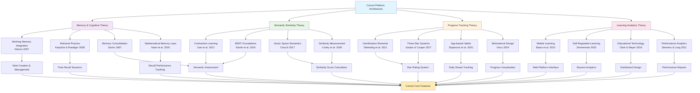

```mermaid
graph TD
    A[Consol Platform Architecture] --> B[Memory & Cognitive Theory]
    A --> C[Semantic Similarity Theory]  
    A --> D[Progress Tracking Theory]
    A --> E[Learning Analytics Theory]

    B --> B1[Working Memory Integration<br/>Klemm 2007]
    B --> B2[Retrieval Practice<br/>Karpicke & Roediger 2008]
    B --> B3[Memory Consolidation<br/>Sachs 1967]
    B --> B4[Mathematical Memory Laws<br/>Naim et al. 2020]

    C --> C1[Contrastive Learning<br/>Gao et al. 2021]
    C --> C2[BERT Foundations<br/>Devlin et al. 2019]
    C --> C3[Vector Space Semantics<br/>Church 2017]
    C --> C4[Similarity Measurement<br/>Corley et al. 2005]

    D --> D1[Gamification Elements<br/>Deterding et al. 2011]
    D --> D2[Three-Star Systems<br/>Gaston & Cooper 2017]
    D --> D3[App-based Habits<br/>Stojanovic et al. 2020]
    D --> D4[Motivational Design<br/>Viscu 2024]

    E --> E1[Mobile Learning<br/>Baars et al. 2022]
    E --> E2[Self-Regulated Learning<br/>Zimmerman 2002]
    E --> E3[Educational Technology<br/>Clark & Mayer 2016]
    E --> E4[Performance Analytics<br/>Siemens & Long 2011]

    B1 --> F[Note Creation & Management]
    B2 --> G[Free Recall Sessions]
    B3 --> H[Semantic Assessment]
    B4 --> I[Recall Performance Tracking]

    C1 --> H
    C2 --> H
    C3 --> J[Similarity Score Calculation]
    C4 --> J

    D1 --> K[Star Rating System]
    D2 --> K
    D3 --> L[Daily Streak Tracking]
    D4 --> M[Progress Visualization]

    E1 --> N[Web Platform Interface]
    E2 --> O[Session Analytics]
    E3 --> P[Dashboard Design]
    E4 --> Q[Performance Reports]

    F --> R[Consol Core Features]
    G --> R
    H --> R
    I --> R
    J --> R
    K --> R
    L --> R
    M --> R
    N --> R
    O --> R
    P --> R
    Q --> R

    style A fill:#e1f5fe
    style B fill:#f3e5f5
    style C fill:#e8f5e8
    style D fill:#fff3e0
    style E fill:#fce4ec
    style R fill:#ffecb3
```