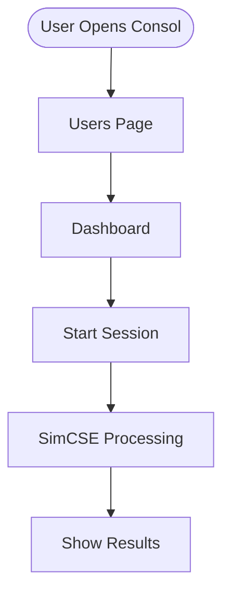
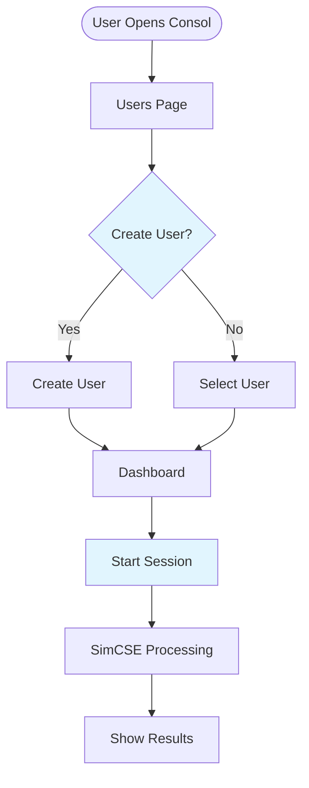

# Simplified Main Flow - For Testing

```mermaid
flowchart TD
    START([User Opens Consol]) --> USERS[Users Page]
    USERS --> DASHBOARD[Dashboard]
    DASHBOARD --> SESSION[Start Session]
    SESSION --> SIMCSE[SimCSE Processing]
    SIMCSE --> RESULTS[Show Results]
```

# If above works, try this medium version:

```mermaid
flowchart TD
    START([User Opens Consol]) --> USERS[Users Page]
    USERS --> CREATE{Create User?}
    CREATE -->|Yes| NEWUSER[Create User]
    CREATE -->|No| SELECT[Select User]
    NEWUSER --> DASHBOARD[Dashboard]
    SELECT --> DASHBOARD
    
    DASHBOARD --> SESSION[Start Session]
    SESSION --> SIMCSE[SimCSE Processing]
    SIMCSE --> RESULTS[Show Results]
    
    classDef userAction fill:#e1f5fe
    class CREATE,SESSION userAction
```