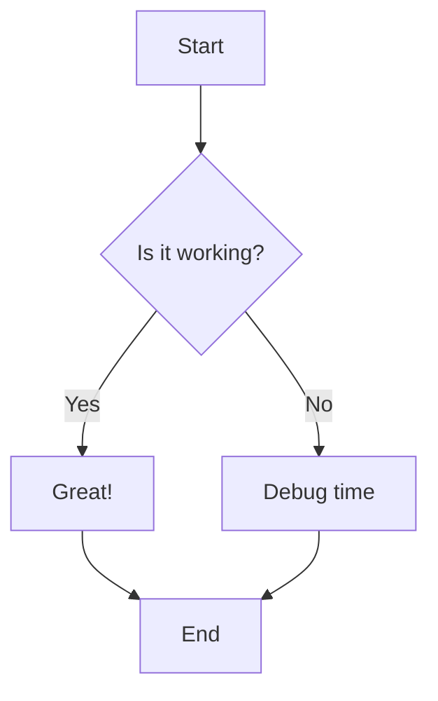
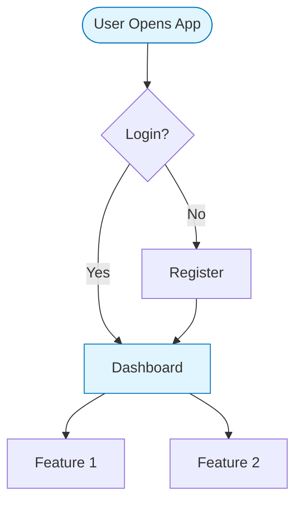

# Simple Mermaid Test

```mermaid
graph TD
    A[Start] --> B{Is it working?}
    B -->|Yes| C[Great!]
    B -->|No| D[Debug time]
    C --> E[End]
    D --> E
```

# Medium Complexity Test

```mermaid
flowchart TD
    START([User Opens App]) --> LOGIN{Login?}
    LOGIN -->|Yes| DASHBOARD[Dashboard]
    LOGIN -->|No| REGISTER[Register]
    REGISTER --> DASHBOARD
    DASHBOARD --> FEATURE1[Feature 1]
    DASHBOARD --> FEATURE2[Feature 2]
    
    classDef startEnd fill:#e1f5fe,stroke:#0277bd
    class START,DASHBOARD startEnd
```